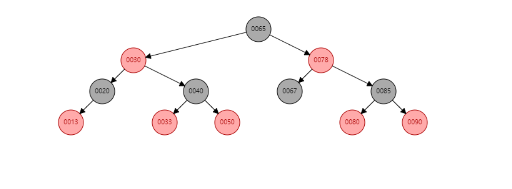
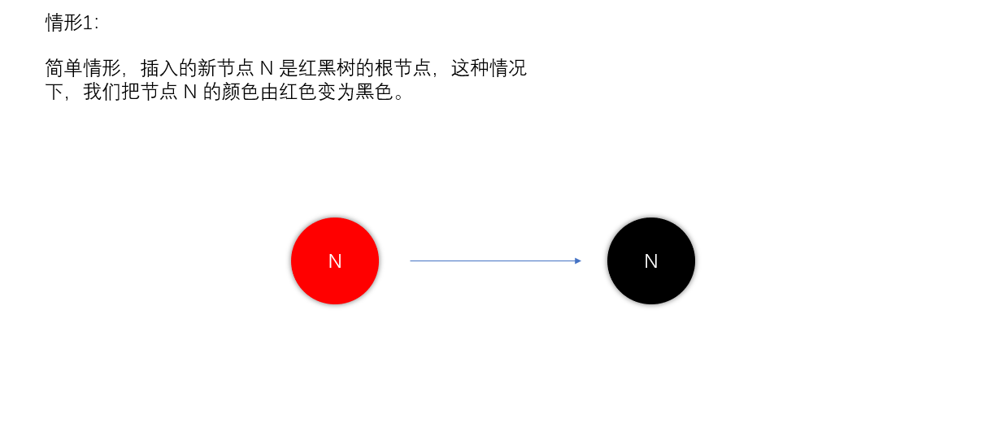
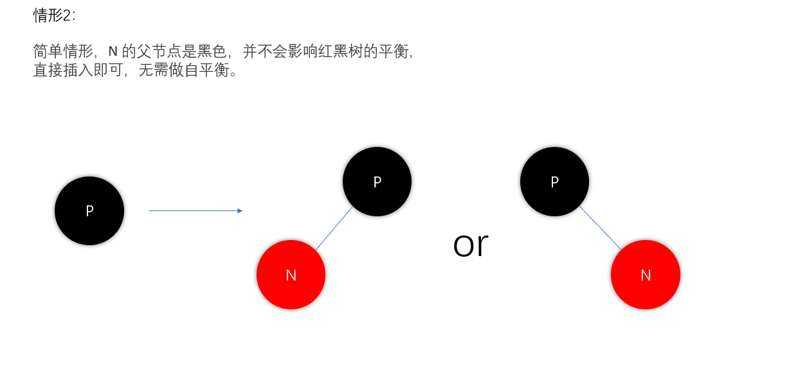
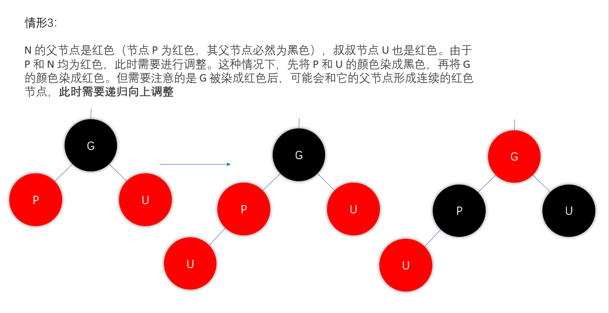
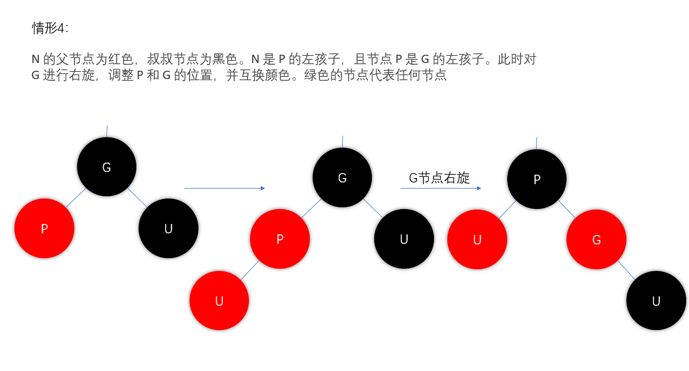
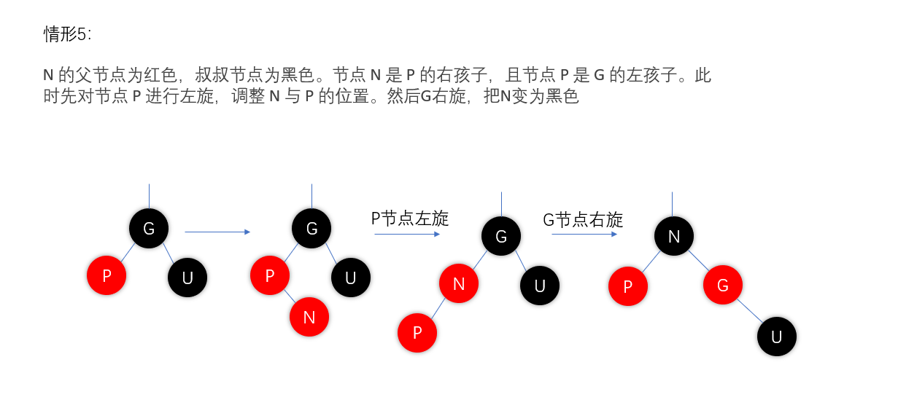

## 简介

红黑树是一种自平衡二叉查找树（不是平衡二叉树，只不过红黑树近似于平衡的状态）,它相对于二叉查找树性能会更加高效(查找、删除、添加等操作需要O(log n),其中n为树中元素的个数),但实现较为复杂(需要保持自身的平衡)。

红黑树的规则：

1. 每个节点要么是红色，要么是黑色
2. 根节点是黑色
3. 如果一个节点是红色，那么它的两个孩子都是黑色（从每个叶子到根的所有路径上不能有两个连续的红色节点）
4. 从根到叶节点或空子节点的每条路径，必须包含相同的黑色节点

从根到叶节点的路径上的黑色节点的数目称为`黑色高度`

## 插入操作

红黑树的插入操作与[二叉搜索树](https://www.jianshu.com/p/59701ade8082)的一致，将新插入的节点初始化，颜色设置为`红色`后插入到指定位置，插入前有几种情形，

接下来，将分析插入红色节点后红黑树的情况。假设要**插入的节点为 N**，**N 的父节点为 P**，**祖父节点为 G**，**叔叔节点为 U**。插入红色节点后(要被插入的节点都会被设置为红色)，会出现5种情况，分别如下：

### 情形1

新节点N位于树的根上，没有父节点。在这种情形下，我们把它重绘为黑色以满足性质2。因为它在每个路径上对黑节点数目增加一，性质5符合。

### 情形2

简单情形，N 的父节点是黑色，并不会影响红黑树的平衡，直接插入即可，无需做自平衡。

### 情形3

N 的父节点是红色（节点 P 为红色，其父节点必然为黑色），叔叔节点 U 也是红色。由于 P 和 N 均为红色，此时需要进行调整。这种情况下，先将 P 和 U 的颜色染成黑色，再将 G 的颜色染成红色。但需要注意的是 G 被染成红色后，可能会和它的父节点形成连续的红色节点，**此时需要递归向上调整**

### 情形4

N 的父节点为红色，叔叔节点为黑色。N 是 P 的左孩子，且节点 P 是 G 的左孩子。此时对 G 进行右旋，调整 P 和 G 的位置，并互换颜色。绿色的节点代表任何节点

### 情形5：

N 的父节点为红色，叔叔节点为黑色。节点 N 是 P 的右孩子，且节点 P 是 G 的左孩子。此时先对节点 P 进行左旋，调整 N 与 P 的位置。然后G右旋。把N变为黑色。

## 删除操作

红黑树的删除操作分成2个部分：
1.按照[二叉搜索树](https://www.jianshu.com/p/59701ade8082)的删除逻辑一样删除节点。
2.重新调整删除节点后的树，使之重新成为红黑树。

在二叉查找树删除节点时，分为 3 种情况：

- 若该删除节点本身是叶子节点，则可以直接删除；
- 若只有一个孩子节点（左孩子或者右孩子），则直接让其孩子节点顶替该删除节点；
- 若有两个孩子结点，则找到该节点的后继节点，用后继节点的值替换删除节点，然后删除后继节点。

以上三种情况最终都需要删除某个节点，此时需要判断删除该节点是否会破坏红黑树的性质。判断的依据是：
1.如果删除结点的颜色为红色，则不会破坏。
2.如果删除结点的颜色为黑色，则肯定会破坏红黑树的第 4 条性质，此时就需要对树进行调整。

相较于插入操作，红黑树的删除操作则要更为复杂一些。删除操作首先要确定待删除节点有几个孩子，如果有两个孩子，不能直接删除该节点。而是要先找到该节点的前驱（该节点左子树中最大的节点）或者后继（该节点右子树中最小的节点），然后将前驱或者后继的值复制到要删除的节点中，最后再将前驱或后继删除。

由于前驱和后继至多只有一个孩子节点，这样我们就把原来要删除的节点有两个孩子的问题转化为只有一个孩子节点的问题，问题被简化了一些。我们并不关心最终被删除的节点是否是我们开始想要删除的那个节点，只要节点里的值最终被删除就行了，至于树结构如何变化，这个并不重要。

红黑树删除操作的复杂度在于删除节点的颜色，当删除的节点是红色时，直接拿其孩子节点补空位即可。因为删除红色节点，性质5（从任一节点到其每个叶子的所有简单路径都包含相同数目的黑色节点）仍能够被满足。

当删除的节点是黑色时，那么所有经过该节点的路径上的黑节点数量少了一个，破坏了性质5。如果该节点的孩子为红色，直接拿孩子节点替换被删除的节点，并将孩子节点染成黑色，即可恢复性质5。但如果孩子节点为黑色，处理起来就要复杂的多。分为6种情况，下面会展开说明。

在展开说明之前，我们先做一些假设，方便说明。这里假设最终被删除的节点为X（至多只有一个孩子节点），其孩子节点为N，X的兄弟节点为S，S的左节点为 SL，右节点为 SR。接下来讨论是建立在节点 X 被删除，节点 N 替换X的基础上进行的。

这里说明把被删除的节点X特地拎出来说一下的原因是防止大家误以为节点N会被删除，不然后面就会看不明白。

在上面的基础上，接下来就可以展开讨论了。红黑树删除有6种情况，分别是：

**情形1：** N 是新的根。在这种情形下，我们就做完了。我们从所有路径去除了一个黑色节点，而新根是黑色的，所以性质都保持着。

**情形2：**S 为红色，其他节点为黑色。这种情况下可以对 N 的父节点进行左旋操作，然后互换 P 与 S 颜色。但这并未结束，经过节点 P 和 N 的路径删除前有3个黑色节点（P -> X -> N），现在只剩两个了（P -> N）。比未经过 N 的路径少一个黑色节点，性质5仍不满足，还需要继续调整。不过此时可以按照情况四、五、六进行调整。

**情形3：** N 的父节点，兄弟节点 S 和 S 的孩子节点均为黑色。这种情况下可以简单的把 S 染成红色，所有经过 S 的路径比之前少了一个黑色节点，这样经过 N 的路径和经过 S 的路径黑色节点数量一致了。但经过 P 的路径比不经过 P 的路径少一个黑色节点，此时需要从情况一开始对 P 进行平衡处理。**

**情形4：**N 的父节点是红色，S 和 S 孩子为黑色。这种情况比较简单，我们只需交换 P 和 S 颜色即可。这样所有通过 N 的路径上增加了一个黑色节点，所有通过 S 的节点的路径必然也通过 P 节点，由于 P 与 S 只是互换颜色，并不影响这些路径。 

这里需要特别说明一下，上图中的节点 N 并非是新插入的节点。当 P 为红色时，P 有两个孩子节点，且孩子节点均为黑色，这样从 G 出发到各叶子节点路径上的黑色节点数量才能保持一致。既然 P 已经有两个孩子了，所以 N 不是新插入的节点。

情况四是由以 N 为根节点的子树中插入了新节点，经过调整后，导致 N 被变为红色，进而导致了情况四的出现。考虑下面这种情况（PR 节点就是上图的 N 节点）：

情形5：S 为黑色，S 的左孩子为红色，右孩子为黑色。N 的父节点颜色可红可黑，且 N 是 P 左孩子。这种情况下对 S 进行右旋操作，并互换 S 和 SL 的颜色。此时，所有路径上的黑色数量仍然相等，N 兄弟节点的由 S 变为了 SL，而 SL 的右孩子变为红色。接下来我们到情况六继续分析。

情形6：S 为黑色，S 的右孩子为红色。N 的父节点颜色可红可黑，且 N 是其父节点左孩子。这种情况下，我们对 P 进行左旋操作，并互换 P 和 S 的颜色，并将 SR 变为黑色。因为 P 变为黑色，所以经过 N 的路径多了一个黑色节点，经过 N 的路径上的黑色节点与删除前的数量一致。对于不经过 N 的路径，则有以下两种情况：

1. 该路径经过 N 新的兄弟节点 SL ，那它之前必然经过 S 和 P。而 S 和 P 现在只是交换颜色，对于经过 SL 的路径不影响。
2. 该路径经过 N 新的叔叔节点 SR，那它之前必然经过 P、 S 和 SR，而现在它只经过 S 和 SR。在对 P 进行左旋，并与 S 换色后，经过 SR 的路径少了一个黑色节点，性质5被打破。另外，由于 S 的颜色可红可黑，如果 S 是红色的话，会与 SR 形成连续的红色节点，打破性质4（每个红色节点必须有两个黑色的子节点）。此时仅需将 SR 由红色变为黑色即可同时恢复性质4和性质5（从任一节点到其每个叶子的所有简单路径都包含相同数目的黑色节点。）。

模拟数据结构的网站推荐 https://www.cs.usfca.edu/~galles/visualization/Algorithms.html