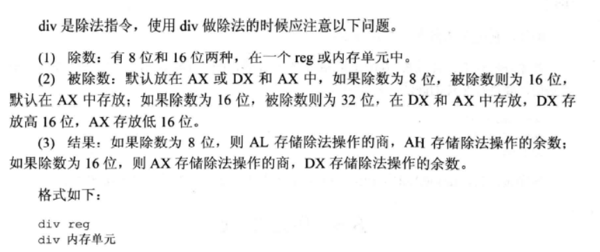
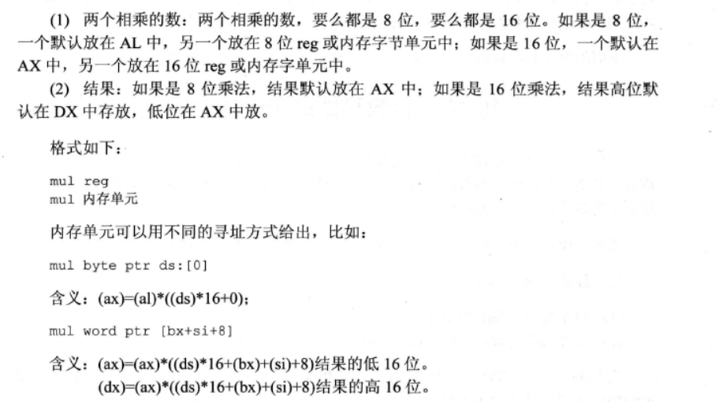
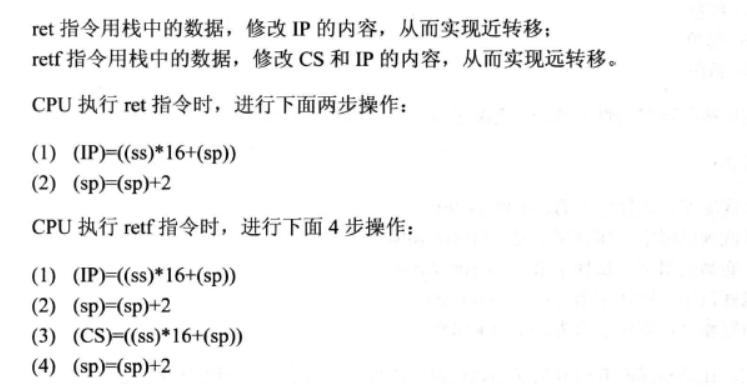
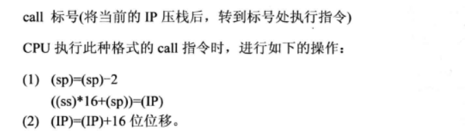
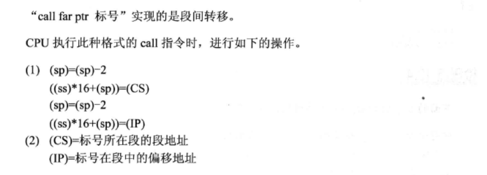

## 寄存器（8086）

### 通用寄存器（16位）

````
AX、BX、CX、DX
````

### 段寄存器

````
CS、DS、SS、ES
````

16位的段寄存器一个段的长度最大就是64 KB

#### CS : IP

读取指令的地址，读取一条指令后，IP 中的值`自动增加`,以使CPU可以读取下一条指令，读取的指令进入指令缓冲区。

- 想要同时修改CS 、IP 的内容，需要 jmp 指令，“ jmp 段地址：偏移的地址”

- 仅修改IP的内容，“jmp 某个合法的寄存器”。

#### SS:SP

SS指向栈的段地址，SP是偏移地址，入栈时，栈顶从高地址向底地址方向增长。任意时刻，SS：IP指向栈顶元素，当栈为空的时候，栈中没有元素，也就不存在栈定的元素，所以SS：IP只能指向栈的最底部单元下面的单元，该单元的地址为栈最底部的字单元的地址+2。

#### DS:SI与DS:DI

DS:SI指向要复制的原始字符串，DS:DI指向复制的目的空间。


## 伪指令

伪指令由编译器来执行。

```
段名 segment
	...
段名 ends
```


`````
end
`````

编译器遇到end伪指令就会停止编译，除了这个功能外，还能通知编译器程序的入口在什么地方。

`````
assume cs:code
code segment
	...
start:
	...
	...
code ends
end start

`````


```
assume
```

将有特定用途的段和相关的段寄存器关联起来，例如：assume cs:codesg,将段codesg和cs关联起来


## 寻址


## 指令

### div



### mul




### 转移指令

- 只修改IP时，称为段内转移，例如：jmp ax
- 同时修改CS和IP时，称为段间转移，例如：jmp 1000:0


### call和ret










