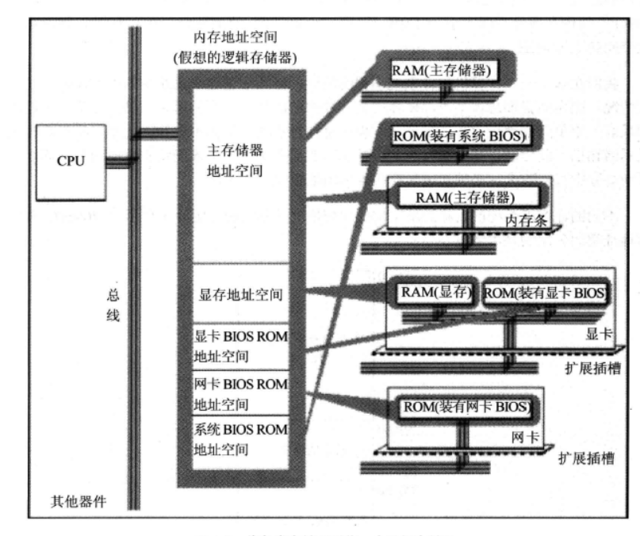

## 内存地址空间



## 寄存器（8086）

### 通用寄存器（16位）

````
AX、BX、CX、DX
````

AX可以再分为AH和AL

BX可以再分为BH和BL

CX可以再分为CH和CL

DX可以再分为DH和DL

### 段寄存器

````
CS、DS、SS、ES
````

16位的段寄存器一个段的长度最大就是64 KB

#### CS : IP

**读取指令的地址，读取一条指令后，IP 中的值`自动增加`**,以使CPU可以读取下一条指令，读取的指令进入指令缓冲区。

- 想要同时修改CS 、IP 的内容，需要 jmp 指令，“ jmp 段地址：偏移的地址”

- 仅修改IP的内容，“jmp 某个合法的寄存器”。
  

在8086CPU加点启动或者复位后，CS和IP被设置为CS=0xFFFF，IP=0x0000，即刚启动时，CPU就从内存0xFFFF0的位置开始读取指令。 

#### SS:SP

SS指向栈的段地址，SP是偏移地址，入栈时，栈顶从高地址向底地址方向增长。任意时刻，SS：IP指向栈顶元素，当栈为空的时候，栈中没有元素，也就不存在栈定的元素，所以SS：IP只能指向栈的最底部单元下面的单元，该单元的地址为栈最底部的字单元的地址+2。

8086CPU的入栈和出栈操作都是以字为单位进行的。

push ax 的执行，如下：

- SP=SP-2，
- 将ax中的内容送入SS:SP指向的内存单元处。

#### DS:SI与DS:DI

DS:SI指向要复制的原始字符串，DS:DI指向复制的目的空间。


### 标志寄存器

- 用来存储相关指令的某些执行结果
- 用来为CPU执行相关指令提供行为依据
- 用来控制CPU的相关工作方式


1. ZF标志（Zero）

   零标志位，它记录相关指令执行后，其结果是否为0，结果为0，ZF=1，否则ZF=0

2. PF标志（Parity）

   奇偶标志位，它记录相关指令执行后，其结果的所有bit位中1的个数是否位偶数，如果1的个数为偶数，PF=1，否则PF=0

3. SF标志（Sign）

   符号标志位，它记录相关指令执行后，其结果是否为负，如果为负，SF=1

4. CF标志

   进位标志位，一般情况下，在进行无符号数运算的时候，它记录了运算结果的最高有效位向更高位的进位值，或从更高位的借位值

5. OF标志

   溢出标志，在进行有符号数运算的时候，如结果超过了机器所能表示的范围称为溢出

   CPU在执行add指令的时候，就包含了两种含义：无符号数运算和有符号数的运算。对于无符号数运算，CPU用CF来记录是否产生了进位；对于有符号数运算，用OF记录是否产生了溢出，当然，还需要用SF来记录结果的符号。


6. DF标志

   方向标志位，在串处理指令中，控制每次操作后si、di的增减。

   DF=0，每次操作后si、di递减

   DF=1，每次操作后si、di递增

   8086CPU提供下面两条指令对DF进行设置

   cld：使DF=0

   std：使DF=1

   

## 伪指令

伪指令由编译器来执行。

```
段名 segment
	...
段名 ends
```

segment与ends的功能时定义一个段。


`````
end
`````

编译器遇到end伪指令就会停止编译，除了这个功能外，还能通知编译器程序的入口在什么地方。

`````
assume cs:code
code segment
	...
start:
	...
	...
code ends
end start

`````


```
assume
```

将有特定用途的段和相关的段寄存器关联起来，例如：assume cs:codesg,将段codesg和cs关联起来


## 寻址


## 指令

### div


### mul


### 转移指令

- 只修改IP时，称为段内转移，例如：jmp ax
- 同时修改CS和IP时，称为段间转移，例如：jmp 1000:0


### call和ret


### shl与shr

shl和shr是逻辑位移指令

shl是逻辑左移指令，它的功能是：

1. 将一个寄存器或内存单元中的数据向左移位
2. 将最后移出的一位写入CF中
3. 最低位用0补充

mov al,01001000b

shl al,1

执行后al=10010000b，CF=0

如果移动位数大于1时，必须将移动位数放在cl中


## 中断

中断过程

1. （从中断信息中）取得中断类型码
2. 标志寄存器的值入栈
3. 设置标志寄存器的TF和IF的值为0
4. CS的内容入栈
5. IP的内容入栈
6. 从内存地址为中断类型码 * 4和中断类型码*4+2的两个子单元中读取中断处理程序的入口地址设置IP和CS

### 可屏蔽中断

可屏蔽中断是CPU可以不响应的外中断，CPU是否响应可屏蔽中断，要看IF是否设置。所以上面中段过程中将IF置为0就在进入中断处理程序后，禁止其他的可屏蔽中断。

### 不可屏蔽中断

CPU在执行完当前指令后，CPU必须响应的中断


## 端口

在PC系统中，CPU最多可以定位64KB个不同的端口，则端口地址的范围为0~65535

端口的读写指令只有两条：in和out

 


